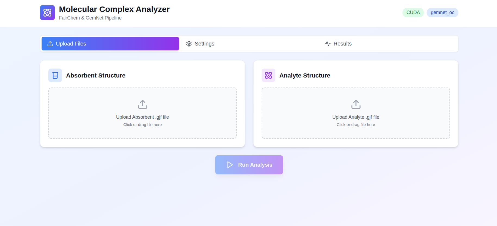
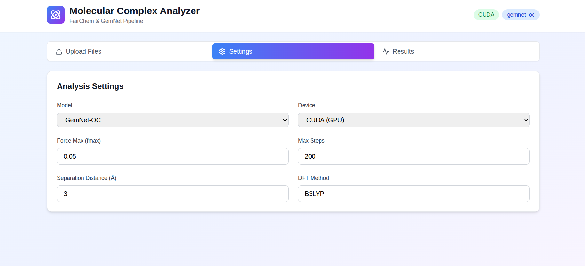

# 🧬 Molecular Complex Analyzer

### *Unleash the Power of AI-Driven Molecular Analysis*

A comprehensive Python toolkit for analyzing molecular complexes using FairChem and GemNet models. Optimizes absorbent and analyte structures, forms complexes, and predicts molecular properties.


---

## ✨ Features

- 🔬 **ML-Powered Optimization** - State-of-the-art FairChem models for precise molecular geometry optimization
- 🔗 **Intelligent Complex Formation** - Automated absorbent-analyte binding with configurable geometries
- 📊 **Comprehensive Property Prediction** - Calculate electronic, energetic, and spectroscopic properties
- 🖥️ **Beautiful GUI** - Modern React-based web interface
- 🐧 **Linux Desktop App** - Installable DEB package for Ubuntu/Debian

---

## 🚀 Quick Start

### Installation
```bash
# Clone the repository
git clone https://github.com/Safi-ullah-majid/Molecular-Complex-Analysis.git
cd Molecular-Complex-Analysis

# Install Python dependencies
pip install -r requirements.txt

# Install frontend dependencies
cd frontend
npm install
cd ..
```

### Running the Application

**Option 1: Web Interface**
```bash
# Terminal 1: Start backend
python3 api.py

# Terminal 2: Start frontend
cd frontend && npm start
```

**Option 2: Linux Desktop App**
```bash
# Install the DEB package
sudo dpkg -i molecular-analyzer-deb.deb

# Run from applications menu or terminal
molecular-analyzer
```

**Option 3: Simple Launcher**
```bash
./launch.sh
```

---

## 📦 Installation Options

### Linux Desktop App (DEB Package)

Download and install the DEB package from [Releases](https://github.com/Safi-ullah-majid/Molecular-Complex-Analysis/releases):
```bash
sudo dpkg -i molecular-analyzer_1.0.1_amd64.deb
molecular-analyzer
```

### From Source
```bash
pip install -r requirements.txt
cd frontend && npm install && npm run build && cd ..
python3 api.py
```

---

## 🎨 Screenshots




---

## 📊 Property Calculations

### Electronic Properties
- HOMO-LUMO gap calculations
- Dipole moment and polarizability tensors
- Molecular orbital analysis

### Energetic Properties
- Binding energy calculations
- Total energy and force analysis
- Thermodynamic properties

### Spectroscopic Properties
- IR frequency predictions
- UV-Vis absorption spectra
- Raman scattering calculations

---

## 🛠️ Development

### Project Structure
```
Molecular-Complex-Analysis/
├── api.py                    # FastAPI backend
├── analyzer.py               # Core analysis code
├── requirements.txt          # Python dependencies
├── launch.sh                 # Simple launcher
├── icon.png                  # App icon
├── frontend/                 # React frontend
│   ├── src/
│   │   ├── App.jsx
│   │   ├── index.js
│   │   └── index.css
│   └── package.json
├── uploads/                  # Uploaded files (gitignored)
├── results/                  # Analysis results (gitignored)
└── README.md
```

### Building the Desktop App
```bash
cd frontend
npm run build
cd ..

# Create DEB package (see docs/BUILD.md)
```

---

## 📄 Usage Example
```python
from analyzer import MolecularComplexAnalyzer

# Initialize analyzer
analyzer = MolecularComplexAnalyzer()

# Analyze complex
structure, properties = analyzer.analyze_complex(
    absorbent_path="absorbent.gjf",
    analyte_path="analyte.gjf",
    output_prefix="complex_analysis"
)

# Access results
print(f"Binding Energy: {properties['binding_energy']:.2f} kcal/mol")
print(f"HOMO-LUMO Gap: {properties['homo_lumo_gap']:.2f} eV")
```

---

## 🤝 Contributing

Contributions are welcome! Please feel free to submit a Pull Request.

1. Fork the repository
2. Create your feature branch (`git checkout -b feature/AmazingFeature`)
3. Commit your changes (`git commit -m 'Add some AmazingFeature'`)
4. Push to the branch (`git push origin feature/AmazingFeature`)
5. Open a Pull Request

---

## 📝 License

This project is licensed under the MIT License - see the [LICENSE](LICENSE) file for details.

---

## 🙏 Acknowledgments

- [FairChem](https://github.com/FAIR-Chem/fairchem) - ML models for molecular property prediction
- [GemNet](https://github.com/TUM-DAML/gemnet_pytorch) - Geometric message passing neural networks
- [ASE](https://wiki.fysik.dtu.dk/ase/) - Atomic Simulation Environment

---

## 📧 Contact

Safi Ullah Majid - [@Safi-ullah-majid](https://github.com/Safi-ullah-majid)

Project Link: [https://github.com/Safi-ullah-majid/Molecular-Complex-Analysis](https://github.com/Safi-ullah-majid/Molecular-Complex-Analysis)

---

<div align="center">

**⭐ Star this repository if you find it helpful!**

Made with ❤️ by Safi Ullah Majid

</div>
