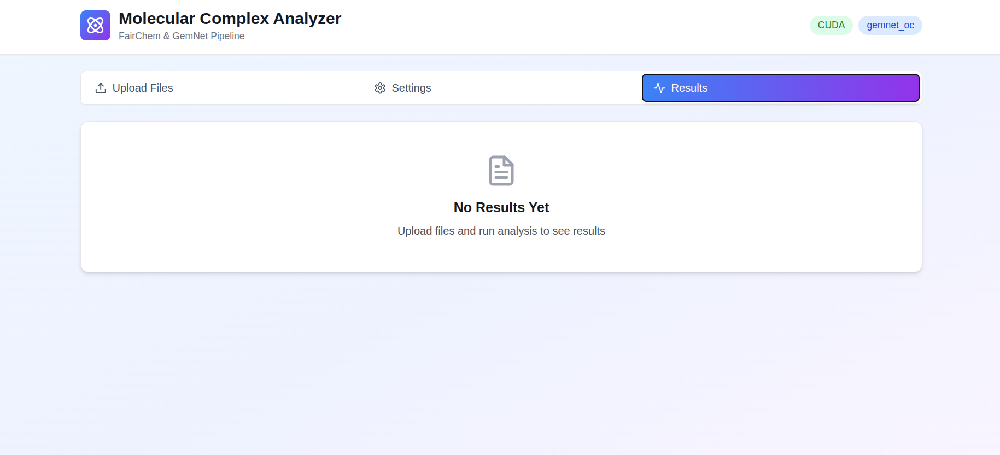

# 🧬 Molecular Complex Analyzer

### *Unleash the Power of AI-Driven Molecular Analysis*

<p align="center">
  
</p>

A comprehensive Python toolkit for analyzing molecular complexes using FairChem and GemNet models. Optimizes absorbent and analyte structures, forms complexes, and predicts molecular properties.

<p align="center">
  
  
  
</p>

---

## ✨ Features

- 🔬 **ML-Powered Optimization** - State-of-the-art FairChem models for precise molecular geometry optimization
- 🔗 **Intelligent Complex Formation** - Automated absorbent-analyte binding with configurable geometries
- 📊 **Comprehensive Property Prediction** - Calculate electronic, energetic, and spectroscopic properties
- 🖥️ **Beautiful GUI** - Modern React-based web interface
- 🐧 **Linux Desktop App** - Installable DEB package for Ubuntu/Debian

---

## 📥 Download

**[⬇️ Download DEB Package (Latest Release)](https://github.com/Safi-ullah-majid/Molecular-Complex-Analysis/releases/latest)**
```bash
# Install
sudo dpkg -i molecular-analyzer-deb.deb

# Run
molecular-analyzer
```

---

## 🚀 Quick Start

### Installation
```bash
# Clone the repository
git clone https://github.com/Safi-ullah-majid/Molecular-Complex-Analysis.git
cd Molecular-Complex-Analysis

# Install Python dependencies
pip install -r requirements.txt

# Install frontend dependencies
cd frontend
npm install
cd ..
```

### Running the Application

**Option 1: Web Interface**
```bash
# Start backend (serves both API and frontend)
python3 api.py

# Open browser at http://localhost:8000
```

**Option 2: Linux Desktop App**
```bash
# Install the DEB package
sudo dpkg -i molecular-analyzer-deb.deb

# Run from applications menu or terminal
molecular-analyzer
```

**Option 3: Simple Launcher**
```bash
./launch.sh
```

---

## 🎨 Screenshots

<div align="center">

### Upload Interface


*Upload your absorbent and analyte .gjf files with drag-and-drop support*

### Analysis Results


*View comprehensive molecular properties including HOMO-LUMO gap, binding energy, and more*

### Settings Panel


*Configure optimization parameters, DFT methods, and computational settings*

</div>

---

## 📊 Property Calculations

<table>
<tr>
<td width="33%">

### 🔋 Electronic Properties
- HOMO-LUMO gap
- Dipole moment
- Polarizability tensors
- Molecular orbital analysis

</td>
<td width="33%">

### ⚡ Energetic Properties
- Binding energy
- Total energy
- Force analysis
- Thermodynamic properties

</td>
<td width="33%">

### 🌈 Spectroscopic Properties
- IR frequencies
- UV-Vis absorption
- Raman scattering
- NMR predictions

</td>
</tr>
</table>

---

## 🛠️ Development

### Project Structure
```
Molecular-Complex-Analysis/
├── api.py                    # FastAPI backend
├── analyzer.py               # Core analysis code
├── requirements.txt          # Python dependencies
├── launch.sh                 # Simple launcher
├── icon.png                  # App icon
├── frontend/                 # React frontend
│   ├── src/
│   │   ├── App.jsx
│   │   ├── index.js
│   │   └── index.css
│   └── package.json
├── docs/                     # Documentation & screenshots
├── uploads/                  # Uploaded files (gitignored)
├── results/                  # Analysis results (gitignored)
└── README.md
```

### Building from Source
```bash
# Build frontend
cd frontend
npm run build
cd ..

# Run the app
python3 api.py
```

### Building DEB Package

See [BUILD.md](docs/BUILD.md) for detailed instructions on creating the Linux desktop app.

---

## 📄 Usage Example
```python
from analyzer import MolecularComplexAnalyzer

# Initialize analyzer
analyzer = MolecularComplexAnalyzer()

# Analyze complex
structure, properties = analyzer.analyze_complex(
    absorbent_path="absorbent.gjf",
    analyte_path="analyte.gjf",
    output_prefix="complex_analysis"
)

# Access results
print(f"Binding Energy: {properties['binding_energy']:.2f} kcal/mol")
print(f"HOMO-LUMO Gap: {properties['homo_lumo_gap']:.2f} eV")
print(f"Dipole Moment: {properties['dipole_moment']:.2f} D")
```

---

## 🤝 Contributing

Contributions are welcome! Here's how you can help:

- 🐛 Report bugs via [Issues](https://github.com/Safi-ullah-majid/Molecular-Complex-Analysis/issues)
- 💡 Suggest features and enhancements
- 📝 Submit pull requests for bug fixes and new features
- 📚 Improve documentation

### Development Setup

1. Fork the repository
2. Create your feature branch (`git checkout -b feature/AmazingFeature`)
3. Commit your changes (`git commit -m 'Add some AmazingFeature'`)
4. Push to the branch (`git push origin feature/AmazingFeature`)
5. Open a Pull Request

---

## 📝 License

This project is licensed under the MIT License - see the [LICENSE](LICENSE) file for details.

---

## 🙏 Acknowledgments

Built with powerful open-source tools:
- [FairChem](https://github.com/FAIR-Chem/fairchem) - ML models for molecular property prediction
- [GemNet](https://github.com/TUM-DAML/gemnet_pytorch) - Geometric message passing neural networks
- [ASE](https://wiki.fysik.dtu.dk/ase/) - Atomic Simulation Environment
- [React](https://reactjs.org/) - Frontend framework
- [FastAPI](https://fastapi.tiangolo.com/) - Backend API framework

---

## 📧 Contact

**Safi Ullah Majid**

- GitHub: [@Safi-ullah-majid](https://github.com/Safi-ullah-majid)
- Project: [Molecular-Complex-Analysis](https://github.com/Safi-ullah-majid/Molecular-Complex-Analysis)

---

<div align="center">

### 💖 Made with passion for computational chemistry

**⭐ Star this repository if you find it helpful!**

[Report Bug](https://github.com/Safi-ullah-majid/Molecular-Complex-Analysis/issues) · [Request Feature](https://github.com/Safi-ullah-majid/Molecular-Complex-Analysis/issues) · [Documentation](https://github.com/Safi-ullah-majid/Molecular-Complex-Analysis/wiki)

</div>
